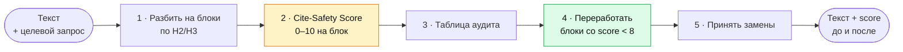

# aeo-trust-blocks

**Проверяет, насколько безопасно AI-поисковикам цитировать ваш текст. Слабые места переписывает в самодостаточные блоки, которые ChatGPT, Perplexity, Google AI Overviews и Яндекс Нейро извлекут без искажения.**

[](LICENSE)
[](#claude-claudeai)
[](#claude-code)
[](#chatgpt-custom-gpt-или-project)
[](#любой-другой-чат-бот)

> [!NOTE]
> **Для кого:** редакция без рантайма (claude.ai, Claude Code, ChatGPT, любой чат-бот) · разработка (сборка выгрузки и витрин).
> **Источник правды:** `SKILL.md` рядом (маршрутизатор) и `skills/optimization/seo-trust-optimization.md` (полная методика, едет справочником `references/aeo-methodology.md`); публичная slash-команда — `_COMMAND.md`. В репозитории ту же работу делает `/seo-trust-optimization`, а методика подключается агентам конвейера на этапах доработки.
> **Смежные:** `skills/optimization/README.md` (скиллы оптимизации и как они едут в конвейер) · `skills/README.md` (выгрузка скиллов и зеркало) · `skills/seo/README.md` (композит написания статьи — пишет с нуля, этот только аудирует готовое). README едет в `dist/` как есть и в standalone-репозиторий без этого блока (`config/skills-mirror.yaml`); пути установки ниже — по раскладке standalone-репозитория, в `dist/` те же файлы лежат в `dist/skill-zips/`, `dist/gpt-packs/`, `dist/prompts/`.

| Даёте | Получаете |
|-------|-----------|
| Готовый текст и целевой запрос читателя | Таблицу аудита: блок, Cite-Safety Score 0–10, проблемы |
| Текст и слова «только аудит» | То же, текст не тронут |
| Текст и слова «переработай» | Переработанные Trust Blocks для слабых мест, пересобранный текст из принятых вами замен, score до и после |

## Кому это нужно

- **SEO-специалисту и контент-маркетологу**, у которых трафик из поиска утекает в AI-ответы и которым нужно попадать внутрь этих ответов.
- **Редактору блога**, который выпускает экспертные статьи и хочет видеть их в AI-ответах со ссылкой на источник.
- **Техническому писателю**: по документации отвечают ассистенты, и им нужны фрагменты, которые можно процитировать целиком.
- **Автору колонки**, чтобы подготовить фактурные блоки под цитирование и сохранить живой текст вокруг них.

## Зачем

Команда выпустила разбор на десять тысяч знаков, с цифрами и опытом двух внедрений. Через неделю маркетолог задаёт ассистенту ровно тот вопрос, на который разбор отвечает, и получает три абзаца из чужой короткой справки. Разбор в ответе не упомянут. Его ключевой абзац начинался с «как мы показали выше, этот подход», цифра шла без источника, а вывод стоял в самом конце раздела.

AI-поисковики не читают страницу целиком. Они режут её на фрагменты, ранжируют по извлекаемости и собирают ответ из лучших. В ответ попадает не самый глубокий текст, а тот, который можно вынуть из контекста и процитировать без риска. У такого фрагмента прямой ответ стоит в первых предложениях, у цифры есть источник, а местоимения не отсылают к соседнему абзацу.

Скилл находит места, которые при извлечении теряют смысл, и переупаковывает их, не трогая фактуру.

## Как это работает



### Из чего складывается Cite-Safety Score

| Критерий | Вес | Максимум даётся, если |
|----------|-----|-----------------------|
| Извлекаемость | 2 | блок полностью понятен без окружающего текста |
| Прямой ответ | 2 | ответ на вопрос заголовка стоит в первых двух предложениях |
| Фактологичность | 2 | цифры и факты идут с источником |
| Структура | 1 | есть список, таблица или выделение, а не сплошной текст |
| Объём | 1 | блок в норме своего типа, без фрагментов короче 20 и длиннее 200 слов |
| Нет имплицитных ссылок | 1 | нет «это», «выше», «данный» без опоры внутри блока |
| Нейтральность | 1 | нет промо-языка и необоснованных оценок |

Блоки с 8 и выше остаются как есть. От 5 до 7 дорабатываются, ниже 5 переписываются заново по формуле Trust Block:

> **[Утверждение] → [Объяснение] → [Граница применимости] → [Пример / Источник]**

### Шесть типов Trust Blocks

| Тип | Что это | Объём | Под какие запросы |
|-----|---------|-------|-------------------|
| Answer capsule | прямой ответ на вопрос заголовка, сразу после H2/H3 | 30–60 слов | любые, для сниппетов и AI-цитат |
| Fact block | факт, источник, год | 1–3 предложения | подтверждение утверждений |
| Comparison | таблица или список с конкретными параметрами | 5–7 строк | «что лучше», «чем отличается» |
| How-to | нумерованные самодостаточные шаги | 3–7 шагов | «как сделать» |
| Definition | термин, определение, контекст, граница | 40–60 слов | «что такое» |
| Key takeaway | вывод раздела в конце H2-секции | 1–2 предложения | обобщающие ответы |

## Примеры

<details>
<summary><b>1. Сравнение без антецедентов превращается в answer capsule</b></summary>

**Целевой запрос:** «чем снапшот отличается от резервной копии»

**До**, score 3/10

> Многие путают эти два понятия, хотя разница принципиальна, о чём мы подробно писали в прошлой статье. Первый вариант удобнее, второй надёжнее, и выбирать нужно с умом.

Проблемы: «эти два понятия», «первый», «второй» без антецедентов, ссылка на другую статью, ни одного прямого ответа, оценки «удобнее» и «надёжнее» без границы применимости.

**После**, score 9/10, тип answer capsule

> Снапшот фиксирует состояние диска на момент времени и хранится рядом с исходными данными: откат занимает минуты, но при потере хранилища снапшот пропадает вместе с ним. Резервная копия лежит отдельно и переживает отказ исходной системы, но восстановление идёт дольше. Снапшот делают перед обновлением, чтобы за минуты откатить неудачное. Резервная копия защищает от потери площадки.

Что изменилось: оба понятия названы, ответ идёт первым предложением, вместо «удобнее» и «надёжнее» показаны механизм и граница применимости. Цифр в исходнике не было, и скилл их не добавил.

</details>

<details>
<summary><b>2. Цифра без источника: скилл не «освежает» её по памяти</b></summary>

**До**, score 2/10

> Исследования показывают, что большинство компаний уже перенесли аналитику в облако, так что откладывать дальше рискованно.

Проблемы: «исследования показывают» без источника и года, «большинство» вместо доли, совет-запугивание вместо факта.

**После**, score 6/10 до подстановки источника и 9/10 после, тип fact block

> `[NEEDS_FACTCHECK: нужен источник и год]` Доля компаний, которые перенесли аналитику в облако: {N}% по данным {источника} ({год}). Перенос оправдан, когда нагрузка на отчёты неравномерна в течение месяца, а собственный кластер простаивает между пиками.

Скилл не подставляет цифру по памяти и не выдумывает исследование. Он оставляет каркас блока с пометкой для фактчекера и переносит совет в границу применимости.

</details>

## Установка

| Где | Что взять | Как активируется |
|-----|-----------|------------------|
| [claude.ai](#claude-claudeai) | `zips/aeo-trust-blocks.zip` | сам, по запросу «проверь текст для AI-выдачи», «сделай AEO-аудит», «повысь цитируемость в AI-поисковиках» |
| [Claude Code](#claude-code) | `.claude/skills/` и `.claude/commands/` | команда `/aeo-trust-blocks` |
| [ChatGPT](#chatgpt-custom-gpt-или-project) | `gpt-packs/aeo-trust-blocks/` | открыть Custom GPT или Project |
| [Любой чат-бот](#любой-другой-чат-бот) | `prompts/aeo-trust-blocks.md` | первым сообщением в чат |

### Claude (claude.ai)

1. Скачайте архив `zips/aeo-trust-blocks.zip`.
2. Загрузите его на [claude.ai/customize/skills](https://claude.ai/customize/skills).
3. Скилл подхватится сам по запросам вида «проверь текст для AI-выдачи», «сделай AEO-аудит», «повысь цитируемость в AI-поисковиках».

### Claude Code

Скопируйте `.claude/skills/aeo-trust-blocks/` и `.claude/commands/aeo-trust-blocks.md` в свой проект (или в `~/.claude/` для всех проектов) и перезапустите Claude Code. Появится команда:

```
/aeo-trust-blocks <текст или путь к файлу>
/aeo-trust-blocks только аудит: <текст>
```

Репозиторий целиком тоже годится как папка скилла: `SKILL.md` и `references/` лежат в корне.

### ChatGPT (Custom GPT или Project)

Готовый пак лежит в `gpt-packs/aeo-trust-blocks/`: содержимое `instructions.txt` в поле Instructions, файл из `knowledge/` в Knowledge. Пошаговая инструкция в README пака.

### Любой другой чат-бот

Gemini, Mistral, GigaChat, YandexGPT, локальные модели: standalone-промт `prompts/aeo-trust-blocks.md`. Скопируйте файл целиком первым сообщением в чат, вторым пришлите текст на аудит. Методика уже внутри промта, прикладывать ничего не нужно.

## Как пользоваться

Пришлите готовый текст (статью, лендинг, документацию) и назовите целевой запрос: на какой вопрос читателя этот текст должен отвечать в AI-выдаче. Один и тот же абзац безопасен для цитирования по одному запросу и бесполезен по другому.

```
Только аудит. Запрос: «как выбрать managed Kubernetes». Текст: <текст>
Переработай. Запрос: «что такое zero trust». Текст: <текст>
```

- **Только аудит** возвращает таблицу блоков со score и проблемами, без переработки.
- **Переработай** добавляет Trust Blocks для блоков со score ниже 8 и пересобирает текст из принятых вами замен.

## Что внутри

- **Шкала Cite-Safety Score.** Семь критериев и чек-лист самодостаточности блока.
- **Каталог слепых зон контекста.** Местоимения без антецедента, обратные ссылки, висячие связки, необъяснённые термины.
- **Формула Trust Block и шесть типов блоков.** Под разные интенты запроса.
- **Замены «размыто → конкретно».** «Быстрое внедрение» → «внедрение за {N} часов», «позволяет» → что именно делает.
- **Правила для цифр.** Только с источником и годом, «по данным экспертов» и «исследования показывают» запрещены.
- **Безопасная JSON-LD-разметка.** Article, FAQPage, Organization для публикации на своём домене.
- **Контракт с голосом канала.** Какие блоки переводить в Trust Blocks, а какие оставить живыми.
- **Защита фактуры.** Цифры, цитаты, ссылки и атрибуции при переработке не меняются, только упаковка вокруг них.

```
.
├── SKILL.md                              маршрутизатор: минимум, процесс, формат
├── references/
│   └── aeo-methodology.md                полная методика: шкала, типы блоков, JSON-LD, голос канала
├── .claude/
│   ├── skills/aeo-trust-blocks/          та же папка для проекта Claude Code
│   └── commands/aeo-trust-blocks.md      slash-команда /aeo-trust-blocks
├── gpt-packs/aeo-trust-blocks/           Custom GPT: instructions.txt и knowledge/
├── prompts/aeo-trust-blocks.md           standalone-промт для любого чат-бота
└── zips/aeo-trust-blocks.zip             архив для claude.ai/customize/skills
```

## Частые вопросы

**Как это соотносится с SEO?** Дополняет его. Классическое SEO приводит страницу в выдачу, AEO решает, какой фрагмент страницы попадёт в AI-ответ и будет ли при нём ссылка на вас.

**Нужно ли переписать в блоки весь текст?** Нет. Обязательны лид, определения, ключевые тезисы, рекомендации, сравнения и выводы. Переходы, авторские отступления и призыв к действию остаются живыми, иначе колонка превращается в справочник.

**Что делать с разметкой?** Если публикуете на своём домене, возьмите из методики шаблоны JSON-LD для Article, FAQPage и Organization. Разметка описывает то, что есть на странице, и не добавляет в неё ничего скрытого.

**Что происходит с цифрой без источника?** Она получает пометку `[NEEDS_FACTCHECK]` и остаётся в тексте без изменений. Достоверность проверяет фактчекер, скилл этим не занимается.

## Границы

- **Аудит готового текста.** Скилл меняет упаковку и не трогает содержание.
- **Не весь текст в блоки.** Лид-сцена, переходы, авторская позиция и призыв к действию остаются живыми. Матрица по каналам лежит в методике.
- **Русский язык** в формулировках и примерах. Сама методика от языка не зависит.

## Откуда это и как обновляется

Репозиторий собирается автоматически из основного репозитория content-agents при каждом изменении источников и перезаписывается целиком. Править что-то нужно в основном репозитории. Сообщения о блоках, которые скилл оценил неверно, приветствуются в issues.

Источники правды в основном репозитории:

- `skills/optimization/aeo-trust-blocks/SKILL.md`, маршрутизатор (этот скилл);
- `skills/optimization/seo-trust-optimization.md` → `references/aeo-methodology.md`, полная методика. В агентном конвейере она подключается на этапах доработки SEO-статей, лендингов, пресс-релизов и статей для СМИ.

Через этот этап проходит каждый материал контент-фабрики, из которой собран репозиторий.
