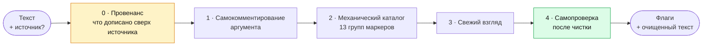

# clean-ai-patterns

**Находит в русскоязычном тексте то, что выдаёт нейросеть, и снимает это точечно. Смысл, структура, цифры и цитаты остаются вашими.**

[](LICENSE)
[](#claude-claudeai)
[](#claude-code)
[](#chatgpt-custom-gpt-или-project)
[](#любой-другой-чат-бот)

> [!NOTE]
> **Для кого:** редакция без рантайма (claude.ai, Claude Code, ChatGPT, любой чат-бот) · разработка (сборка выгрузки и витрин).
> **Источник правды:** правило `rules/common/ai-pattern-cleanup.md` (каталог маркеров, кластеризация, самопроверка после чистки), раздел «Не дописывать сверх источника» в `rules/common/input-material-trust.md`, `rules/common/technical-punctuation.md`, каталог кодовых точек `skills/quality/unicode-hygiene/_unicode-categories.md`; маршрутизатор — `SKILL.md` рядом, публичная slash-команда — `_COMMAND.md`. В репозитории ту же работу делают команда `/clean-ai-patterns`, режим 7 `content-editor` и детекторы `check_ai_patterns.py` / `check_unicode_hygiene.py` / `check_rhythm.py`.
> **Смежные:** `skills/quality/README.md` (скиллы качества) · `skills/README.md` (выгрузка скиллов и зеркало) · `docs/signal-triage.md` (сигналы детекторов в конвейере). README едет в `dist/` как есть и в standalone-репозиторий без этого блока (`config/skills-mirror.yaml`); пути установки ниже — по раскладке standalone-репозитория, в `dist/` те же файлы лежат в `dist/skill-zips/`, `dist/gpt-packs/`, `dist/prompts/`.

| Даёте | Получаете |
|-------|-----------|
| Готовый текст | Таблицу флагов: серьёзность, категория, цитата, правка |
| Текст и слова «только флаги» | То же, текст не тронут (режим **detect**) |
| Текст и слова «почисти» | Флаги и очищенный текст целиком (режим **fix**) |
| Текст и его источник: заметки, расшифровку, черновик | Плюс провенанс-проход: что модель дописала сверх того, что вы знали и сказали |

## Кому это нужно

- **Редактору**, который принимает тексты от авторов и не хочет угадывать, где автор писал сам, а где вставил ответ ассистента.
- **Автору**, который пишет с ассистентом и хочет сдать текст, звучащий как его собственный.
- **Переводчику и локализатору**: машинный подстрочник несёт те же маркеры, что и машинная проза.
- **Контент-маркетологу**, у которого посты, рассылки и лендинги идут потоком, а править руками некогда.

## Зачем

Редактору принесли кейс: три причины успеха, четыре этапа внедрения и вывод, который закрывает тему. Текст гладкий, канцеляризмов нет, стоп-лист его пропустит. А в заметках инженера, с которых кейс писали, стояли два факта рядом и честное «почему сработало, не разбирались». Причину между фактами, ряд из четырёх этапов и уверенный финал дописала модель.

Такие тексты словарём не ловятся. Обороты, по которым узнавали машинную прозу год назад, уже сменились, а устройство осталось прежним: дописанная причинность, симметрия, которой не было в источнике, концовка сильнее авторской. Руками это тоже ловится плохо. Глаз замыливается, а сверять каждый абзац с заметками долго.

Поэтому чистка здесь начинается со сверки с источником, а словарь идёт последним. Заканчивается она проверкой на пересушенность. После чистки текст часто становится стерильным, и последний проход возвращает ему голос, не добавляя новых паттернов.

## Как это работает



Проход 0 включается только с приложенным источником. Без него расхождения не выдумываются, а формулируются вопросом автору. Проход 4 работает только в режиме fix.

**Принцип кластера.** Любой маркер из каталога встречается и у живых авторов. Поэтому сигнал даёт стая: три маркера и больше в одном абзаце. Одиночное совпадение сигналом не считается. Исключения, где одиночное вхождение уже дефект: технические артефакты генерации, следы чат-бота, невидимые символы, самокомментирование аргумента.

## Примеры

<details>
<summary><b>1. Абзац без единого «запретного слова», который всё равно машинный</b></summary>

Ни одного канцеляризма, ни одного «в современном мире». Стоп-лист такой абзац пропустит.

**До**

> Скажу прямо: миграция на новый биллинг тянулась полгода, и это самое показательное, что случилось с продуктом за год. Дальше будет про деньги, но сначала важный момент. Переезд стал поворотным моментом для поддержки: оперативность, прозрачность и слаженность выросли заметно. И точка.

**Флаги**

| # | Серьёзность | Категория | Нарушение | Цитата | Правка |
|---|-------------|-----------|-----------|--------|--------|
| 1 | критичное | Псевдоискренность | объявление прямоты перед и без того прямым утверждением | «Скажу прямо:» | снять |
| 2 | критичное | Самокомментирование | текст оценивает собственное доказательство вместо того, чтобы его привести | «самое показательное, что случилось» | оставить факт, оценку отдать читателю |
| 3 | критичное | Самокомментирование | указатель по структуре вместо перехода | «Дальше будет про деньги, но сначала важный момент» | убрать, переход сделает сам текст |
| 4 | критичное | Модельный регистр | пафос вместо события | «стал поворотным моментом» | сказать, что именно изменилось |
| 5 | критичное | Модельный регистр | три существительных на «-ость» подряд: событие подменено свойствами | «оперативность, прозрачность и слаженность» | вернуть событие и деятеля |
| 6 | критичное | Псевдоискренность | усилитель отдельным предложением | «И точка.» | убрать |

Шесть маркеров в одном абзаце. Это кластер, правим.

**После**

> Миграция на новый биллинг тянулась полгода. После переезда поддержка стала работать быстрее и прозрачнее `[вопрос автору: что именно изменилось и чем это измерено?]`.

**Живой текст: 1/5.** Есть деятель и действие, но нет ни одного числа, имени или примера. Скилл не дописывает фактуру за автора, поэтому ставит вопрос вместо выдуманной метрики.

</details>

<details>
<summary><b>2. Провенанс: что модель дописала сверх заметок автора</b></summary>

К тексту приложен источник: короткие заметки автора после проекта.

**Заметки автора (источник)**

> Перешли на ClickHouse в марте, заодно переписали запросы. С апреля отчёты строятся минут за пять вместо получаса. Почему так резко, сами до конца не поняли.

**Текст, который принесли на чистку**

> Переход на ClickHouse в марте сократил время построения отчётов с 30 до 5 минут. Ускорение объясняется колоночным хранением: аналитические запросы читают только нужные столбцы. Таким образом, миграция полностью решила проблему медленной аналитики.

**Флаги**

| # | Серьёзность | Категория | Нарушение | Цитата | Правка |
|---|-------------|-----------|-----------|--------|--------|
| 1 | критичное | Провенанс: недоказанная связка | в заметках два факта рядом, в тексте между ними причина | «Переход … сократил время» | вернуть соседство без причины |
| 2 | критичное | Провенанс: аккуратное объяснение | автор написал «не поняли», текст выдал стройный механизм и потерял переписанные запросы | «объясняется колоночным хранением» | вернуть незнание, оно и есть содержание |
| 3 | критичное | Провенанс: концовка сильнее авторской | в источнике вопрос открыт, в тексте «полностью решила» | «полностью решила проблему» | вернуть открытый финал |
| 4 | незначит. | Пустая связка | «таким образом» без вывода из предыдущего | «Таким образом,» | снять |

**После**

> В марте перешли на ClickHouse и заодно переписали запросы. С апреля отчёты строятся примерно за 5 минут вместо 30. Что именно дало ускорение, команда не разбирала.

Числа сохранены, причинность и объяснение возвращены к тому, что автор знал на самом деле. Без приложенного источника строки 1–3 были бы вопросами автору, без правок.

</details>

<details>
<summary><b>3. Одиночные находки вне порога кластера</b></summary>

Здесь достаточно одного вхождения, кластер не нужен.

| Что нашлось | Категория | Почему одиночное уже дефект |
|-------------|-----------|-----------------------------|
| `https://…/docs?utm_source=chatgpt.com` | технический артефакт | ссылка скопирована из ответа чат-бота вместе с меткой |
| «Отличный вопрос! Давайте разберёмся.» в начале раздела статьи | след чат-бота | реплика интерфейса, а не автора |
| цитата обёрнута символами из области Private Use (U+E200…U+E2FF), в редакторе их не видно | невидимые символы | служебная разметка генерации, ломает поиск и копирование |
| «Это меня и убедило окончательно.» после аргумента | самокомментирование | текст оценивает своё доказательство вместо того, чтобы его усилить |

</details>

## Установка

| Где | Что взять | Как активируется |
|-----|-----------|------------------|
| [claude.ai](#claude-claudeai) | `zips/clean-ai-patterns.zip` | сам, по запросу «убери нейрослоп», «почисти от ИИ-маркеров», «что здесь выдаёт нейросеть» |
| [Claude Code](#claude-code) | `.claude/skills/` и `.claude/commands/` | команда `/clean-ai-patterns` |
| [ChatGPT](#chatgpt-custom-gpt-или-project) | `gpt-packs/clean-ai-patterns/` | открыть Custom GPT или Project |
| [Любой чат-бот](#любой-другой-чат-бот) | `prompts/clean-ai-patterns.md` | первым сообщением в чат |

### Claude (claude.ai)

1. Скачайте архив `zips/clean-ai-patterns.zip`.
2. Загрузите его на [claude.ai/customize/skills](https://claude.ai/customize/skills).
3. Скилл подхватится сам по запросам вида «убери нейрослоп», «почисти от ИИ-маркеров», «что здесь выдаёт нейросеть».

### Claude Code

Скопируйте `.claude/skills/clean-ai-patterns/` и `.claude/commands/clean-ai-patterns.md` в свой проект (или в `~/.claude/` для всех проектов) и перезапустите Claude Code. Появится команда:

```
/clean-ai-patterns <текст или путь к файлу>
/clean-ai-patterns только флаги: <текст>
```

Репозиторий целиком тоже годится как папка скилла: `SKILL.md` и `references/` лежат в корне.

### ChatGPT (Custom GPT или Project)

Готовый пак лежит в `gpt-packs/clean-ai-patterns/`: содержимое `instructions.txt` в поле Instructions, файлы из `knowledge/` в Knowledge. Пошаговая инструкция в README пака.

### Любой другой чат-бот

Gemini, Mistral, GigaChat, YandexGPT, локальные модели: standalone-промт `prompts/clean-ai-patterns.md`. Скопируйте файл целиком первым сообщением в чат, вторым пришлите текст. Каталоги уже внутри промта, прикладывать ничего не нужно.

## Как пользоваться

Пришлите готовый текст и скажите, что нужно. Три рабочие формулировки:

```
Только флаги: <текст>
Почисти: <текст>
Почисти, источник прилагаю. Текст: <текст>  Источник: <заметки, расшифровка, черновик>
```

- **Только флаги** удобны, когда текст чужой или правки согласовываются.
- **Почисти** возвращает таблицу и очищенный текст целиком.
- **Источник** включает провенанс-проход. Скилл покажет, где модель дописала причину, уверенность или вывод, которых у вас не было.

Объём правок пропорционален реальным проблемам. Живой текст даёт мало флагов.

## Что внутри

- **Каталог маркеров.** 13 групп справочником: hedge-зачины, параллелизмы, триады ради ритма, пустые связки со счётными порогами, водянистые обобщения, тире как тик, утечка редакционной кухни, редакционные пометки и открытые вопросы, закольцовка, псевдоискренность двух поколений, следы чат-бота и технические артефакты (маркеры цитирования, UTM-метки чат-ботов, служебные токены), самокомментирование, модельный регистр.
- **Таблица структурной переполненности.** Для провенанса: недоказанная связка, усиленная уверенность, аккуратное объяснение вместо «не знаю», подгонка под ряд, приписанная реакция читателя, концовка сильнее авторской.
- **Матрица защищённых элементов.** Числа, даты, версии, ссылки, сноски, цитаты и атрибуции не меняются. Маркер рядом с ними правится вокруг них.
- **Калибровка против ложных правок.** Пассив не маркер, безупречная типографика не маркер, вердикт стороннего ИИ-детектора не истина. Правка, которая делает текст ровнее и безличнее, вредна, даже когда маркер настоящий.
- **Шкала «Живой текст» 0–5.** В каждом отчёте: конкретное имя или цифра, позиция автора, живые глаголы, не больше одного прилагательного у существительного, нет парных эпитетов. Показывает, чего тексту не хватает, чтобы звучать своим.
- **Unicode-гигиена.** Каталог невидимых символов, обёрток цитат чат-ботов и гомоглифов.

```
.
├── SKILL.md                              маршрутизатор: принцип, проходы, формат
├── references/
│   ├── ai-pattern-cleanup.md             каталог маркеров §1–13, самопроверка, калибровка
│   ├── provenance.md                     структурная переполненность, режим «без источника»
│   ├── technical-punctuation.md          тире, выбор знака, ритм и парцелляция
│   └── unicode-categories.md             невидимые символы, PUA-обёртки, гомоглифы
├── .claude/
│   ├── skills/clean-ai-patterns/         та же папка для проекта Claude Code
│   └── commands/clean-ai-patterns.md     slash-команда /clean-ai-patterns
├── gpt-packs/clean-ai-patterns/          Custom GPT: instructions.txt и knowledge/
├── prompts/clean-ai-patterns.md          standalone-промт для любого чат-бота
└── zips/clean-ai-patterns.zip            архив для claude.ai/customize/skills
```

## Частые вопросы

**Это ИИ-детектор?** Нет. Скилл не выносит вердикт «написано моделью», он показывает конкретные места и предлагает конкретные правки. Вердикты сторонних детекторов он сам не считает доказательством.

**Почему флагов так мало?** Потому что текст живой. Скилл не выполняет квоту правок. Одиночный маркер в живом абзаце он пометит, но править предложит там, где маркеры идут стаей.

**Чем это отличается от просьбы «перепиши по-человечески»?** Порядком проходов (сначала источник, потом лексика), каталогом с цитатами вместо общего впечатления, защитой чисел и цитат, самопроверкой на пересушенность. И тем, что смысл и структуру скилл не переписывает.

**Работает с английским?** Лексическая часть каталога русская. Три слоя от языка не зависят: провенанс, самокомментирование, технические артефакты.

## Границы

- **Стиль, не факты.** Утверждения не проверяются, логика не правится, чужие цитаты не трогаются.
- **В чате приблизительно.** Плотность тире, ритм и невидимые символы точно считает только программный детектор. Модель в чате оценивает их на глаз, поэтому перед публикацией прогоняйте текст и через детектор.
- **Список маркеров живёт.** Обороты устаревают, модели меняют отпечаток. При сомнении «автор или модель» решение в пользу автора.

## Откуда это и как обновляется

Репозиторий собирается автоматически из основного репозитория content-agents при каждом изменении источников и перезаписывается целиком. Править что-то нужно в основном репозитории. Сообщения о ложных срабатываниях и новых маркерах приветствуются в issues.

Источники правды в основном репозитории:

- `skills/quality/clean-ai-patterns/SKILL.md`, маршрутизатор (этот скилл);
- `rules/common/ai-pattern-cleanup.md` → `references/ai-pattern-cleanup.md`, каталог маркеров, кластеризация, матрица правки, самопроверка после чистки;
- `rules/common/input-material-trust.md` → `references/provenance.md`, структурная переполненность и доверие к входному материалу;
- `rules/common/technical-punctuation.md` → `references/technical-punctuation.md`, тире, выбор знака, ритм;
- каталог кодовых точек → `references/unicode-categories.md`.

Методика используется в контент-фабрике: те же правила получают автор и финальный редактор конвейера, а машинные детекторы блокируют публикацию при нарушениях.
